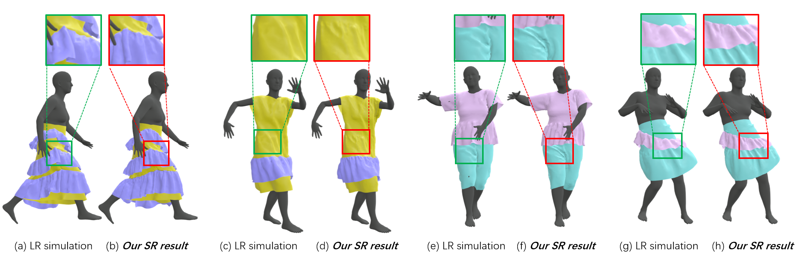

# Neural-Garment-Dynamic-Super-resolution

## Introduction
  
This repository contains the implemetation of our Siggraph Asia 2024 paper, [Neural Garment Dynamic Super-resolution](https://github.com/MengZephyr/Neural-Garment-Dynamic-Super-resolution/blob/main/papers/GDSR_SIGA_2024.pdf). Given low-resolution (LR) garment simulation as input(a,c,e,g), we present a learning-based method of garment dynamic super resolution (GDSR) to construct high-resolution garment dynamic geometry(b, d, d, h). We learn super resolution (SR) features from the coarse garment dynamics and the garment-body interactions, to produce high-resolution fine-grained and plausible wrinkle details to enhance the low-resolution geometry of various garment types, and enable the generalization ability of our method across unseen body motions(b, d, d, h), unseen body shape(d, f), and unseen garment types(f, h).

We provide Google drive links for downloading the training data (five outfits and some motion sequences), the network checkpoint:
>[Five outfits](https://drive.google.com/drive/folders/1vNkcLLMDHyUzN40RE6x8LbNXIjQ3LspF?usp=sharing)  
>[body motions](https://drive.google.com/drive/folders/1tXZCJiVOuLLa2fuOlwrCKhA5_v3vY0eP?usp=sharing)  
>[Checkpoint](https://drive.google.com/file/d/1lrYa4SK0uH1IdjrvzjBHyD-a-tc60BCe/view?usp=sharing)  

